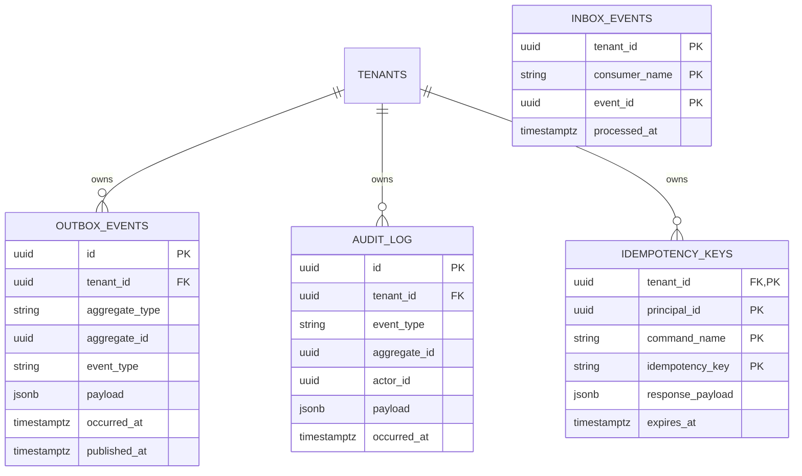

# Public Schema Design — Multi-Tenant SaaS Infrastructure

## 📋 Overview

The **public schema** is the backbone of the Providence AI multi-tenant SaaS platform. It contains cross-tenant infrastructure tables that enable:

- **Tenant isolation** (schema-per-tenant with central registry)
- **Event-driven architecture** (Debezium outbox + Kafka)
- **Exactly-once semantics** (inbox pattern for consumers)
- **Universal idempotency** (all state-changing operations)
- **Immutable audit trail** (compliance and security)

All tables in the `public` schema are visible across all tenants. Each tenant's business data resides in a dedicated schema (`t_<tenant_slug>`), providing complete data isolation.

---

## 🗂️ Schema Architecture

```
┌─────────────────────────────────────────────────────────────────┐
│                        PostgreSQL Database                       │
├─────────────────────────────────────────────────────────────────┤
│                                                                   │
│  PUBLIC SCHEMA (cross-tenant infrastructure)                     │
│  ┌──────────────────────────────────────────────────────────┐  │
│  │ • tenants          — Tenant registry                      │  │
│  │ • outbox_events    — Debezium CDC source                 │  │
│  │ • audit_log        — Immutable audit trail               │  │
│  │ • idempotency_keys — Universal idempotency cache         │  │
│  │ • inbox_events     — Consumer deduplication              │  │
│  └──────────────────────────────────────────────────────────┘  │
│                                                                   │
│  TENANT SCHEMAS (one per tenant)                                 │
│  ┌─────────────┐  ┌─────────────┐  ┌─────────────┐            │
│  │ t_acme      │  │ t_globex    │  │ t_initech   │   ... 10K+  │
│  ├─────────────┤  ├─────────────┤  ├─────────────┤            │
│  │ • projects  │  │ • projects  │  │ • projects  │            │
│  │ • resources │  │ • resources │  │ • resources │            │
│  │ • ledger    │  │ • ledger    │  │ • ledger    │            │
│  │ • budgets   │  │ • budgets   │  │ • budgets   │            │
│  └─────────────┘  └─────────────┘  └─────────────┘            │
│                                                                   │
└─────────────────────────────────────────────────────────────────┘
```

---

## 📊 Table Relationships



---

## 🗃️ Table Specifications

### 1. `public.tenants` — Tenant Registry

**Purpose:** Central registry for all tenants (organizations) in the platform.

**Schema:**
| Column | Type | Constraints | Description |
|--------|------|-------------|-------------|
| `id` | UUID | PRIMARY KEY | Tenant identifier (used in JWT, foreign keys) |
| `slug` | VARCHAR(50) | UNIQUE, NOT NULL | URL-safe identifier (e.g., `acme`) |
| `name` | VARCHAR(100) | NOT NULL | Human-readable name |
| `schema_name` | VARCHAR(63) | UNIQUE, NOT NULL | PostgreSQL schema (e.g., `t_acme`) |
| `status` | VARCHAR(20) | NOT NULL | `ACTIVE`, `SUSPENDED`, `DELETED` |
| `subscription_tier` | VARCHAR(50) | NULLABLE | `FREE`, `PROFESSIONAL`, `ENTERPRISE` |
| `created_at` | TIMESTAMPTZ | NOT NULL | Tenant creation timestamp |
| `updated_at` | TIMESTAMPTZ | NOT NULL | Last update timestamp |

**Indexes:**
- `idx_tenants_slug` — Fast subdomain resolution
- `idx_tenants_status` — Filter by lifecycle status
- `idx_tenants_schema_name` — Hibernate tenant resolver lookup

**Usage:**
```java
// TenantResolutionFilter: Resolve subdomain → tenant_id
UUID tenantId = tenantRegistry.findBySlug("acme");

// Hibernate: Map tenant_id → schema_name
String schemaName = tenantRegistry.getSchemaName(tenantId); // "t_acme"
connection.execute("SET search_path TO " + schemaName + ", public");
```

**Migration:** [`V001__create_tenants_table.sql`](src/main/resources/db/migration/public/V001__create_tenants_table.sql)

---

### 2. `public.outbox_events` — Debezium CDC Source

**Purpose:** Transactional outbox pattern for guaranteed event delivery to Kafka.

**Flow:**
1. Application writes domain mutation to `t_<tenant>` schema
2. Application writes event to `public.outbox_events` (same transaction)
3. Transaction commits → both changes are atomic
4. Debezium CDC reads from `outbox_events` via PostgreSQL logical replication
5. Debezium publishes to Kafka topic: `ecap.events.<event_type>`

**Schema:**
| Column | Type | Constraints | Description |
|--------|------|-------------|-------------|
| `id` | UUID | PRIMARY KEY | Event identifier (Kafka message key) |
| `tenant_id` | UUID | FOREIGN KEY | Tenant that owns this event |
| `aggregate_type` | VARCHAR(100) | NOT NULL | Aggregate root (e.g., `Project`, `User`) |
| `aggregate_id` | UUID | NOT NULL | Instance ID of aggregate |
| `event_type` | VARCHAR(100) | NOT NULL | Event type (e.g., `ProjectCreated`) |
| `event_version` | INT | NOT NULL | Schema version for payload |
| `occurred_at` | TIMESTAMPTZ | NOT NULL | Business time when event occurred |
| `published_at` | TIMESTAMPTZ | NULLABLE | Timestamp when Debezium published |
| `correlation_id` | UUID | NOT NULL | Distributed trace ID |
| `causation_id` | UUID | NULLABLE | Event that caused this event (chain) |
| `actor_id` | UUID | NULLABLE | User/service that triggered event |
| `payload` | JSONB | NOT NULL | Event data (domain event record) |

**Indexes:**
- `idx_outbox_published_at` — Debezium reads unpublished events
- `idx_outbox_tenant_occurred` — Tenant event history
- `idx_outbox_aggregate` — Aggregate event stream
- `idx_outbox_correlation_id` — Distributed tracing

**Debezium Configuration:**
```json
{
  "name": "providence-outbox-connector",
  "config": {
    "connector.class": "io.debezium.connector.postgresql.PostgresConnector",
    "table.include.list": "public.outbox_events",
    "transforms": "outbox",
    "transforms.outbox.type": "io.debezium.transforms.outbox.EventRouter",
    "transforms.outbox.route.topic.replacement": "ecap.events.${routedByValue}"
  }
}
```

**Usage:**
```java
@Transactional
public Project create(CreateProjectCommand cmd) {
    // 1. Mutate domain
    Project project = new Project(cmd.name());
    projectRepo.save(project);

    // 2. Emit outbox event (same transaction)
    outboxService.publish(new ProjectCreated(project.id(), ...));

    // Commit → Debezium publishes to Kafka
}
```

**Retention:** Archive/delete events after 90 days (after Kafka retention period).

**Migration:** [`V002__create_outbox_events_table.sql`](src/main/resources/db/migration/public/V002__create_outbox_events_table.sql)

---

### 3. `public.audit_log` — Immutable Audit Trail

**Purpose:** Compliance-grade audit logging for enterprise survivability (SOC 2, GDPR, HIPAA).

**Retention:** **NEVER delete** — Archive to cold storage after 7 years.

**Schema:**
| Column | Type | Constraints | Description |
|--------|------|-------------|-------------|
| `id` | UUID | PRIMARY KEY | Audit event identifier |
| `tenant_id` | UUID | FOREIGN KEY | Tenant that owns this audit event |
| `event_type` | VARCHAR(100) | NOT NULL | Event type (e.g., `USER_ROLE_ASSIGNED`) |
| `aggregate_type` | VARCHAR(100) | NOT NULL | Affected entity type |
| `aggregate_id` | UUID | NOT NULL | Affected entity ID |
| `actor_id` | UUID | NOT NULL | User/service that performed action |
| `actor_type` | VARCHAR(50) | NOT NULL | `USER`, `SERVICE`, `SYSTEM`, `ANONYMOUS` |
| `occurred_at` | TIMESTAMPTZ | NOT NULL | Immutable timestamp |
| `correlation_id` | UUID | NOT NULL | Distributed trace ID |
| `ip_address` | INET | NULLABLE | Client IP address |
| `user_agent` | TEXT | NULLABLE | HTTP User-Agent header |
| `payload` | JSONB | NOT NULL | Before/after states, changes |

**Indexes:**
- `idx_audit_tenant_occurred` — Tenant audit history
- `idx_audit_aggregate` — Aggregate change history
- `idx_audit_actor` — User activity tracking
- `idx_audit_event_type` — Compliance report filtering

**Immutability Enforcement:**
```sql
-- Triggers prevent UPDATE and DELETE operations
CREATE TRIGGER trg_prevent_audit_update BEFORE UPDATE ON public.audit_log ...
CREATE TRIGGER trg_prevent_audit_delete BEFORE DELETE ON public.audit_log ...
```

**Usage:**
```java
// Log privilege change
auditLogService.log(AuditEvent.builder()
    .tenantId(tenantId)
    .eventType("USER_ROLE_ASSIGNED")
    .aggregateType("User")
    .aggregateId(userId)
    .actorId(adminUserId)
    .payload(Map.of("role", "ADMIN", "before", "MEMBER"))
    .build());
```

**Compliance Queries:**
```sql
-- Who accessed Project X in the last 30 days?
SELECT actor_id, occurred_at, ip_address
FROM public.audit_log
WHERE tenant_id = '...' AND aggregate_id = '...'
  AND occurred_at > NOW() - INTERVAL '30 days'
ORDER BY occurred_at DESC;
```

**Migration:** [`V003__create_audit_log_table.sql`](src/main/resources/db/migration/public/V003__create_audit_log_table.sql)

---

### 4. `public.idempotency_keys` — Universal Idempotency

**Purpose:** Enforce idempotency for ALL state-changing operations (REST + gRPC).

**Mandate (CLAUDE.md Section 25):**
- REST: Require `Idempotency-Key` header for `POST`/`PUT`/`PATCH`/`DELETE`
- gRPC: Require `idempotency-key` metadata for all mutations

**Schema:**
| Column | Type | Constraints | Description |
|--------|------|-------------|-------------|
| `tenant_id` | UUID | PRIMARY KEY | Tenant that owns this key |
| `principal_id` | UUID | PRIMARY KEY | User/service that sent request |
| `command_name` | VARCHAR(100) | PRIMARY KEY | Command identifier (e.g., `POST_/api/projects`) |
| `idempotency_key` | VARCHAR(64) | PRIMARY KEY | Client-provided UUIDv4 |
| `created_at` | TIMESTAMPTZ | NOT NULL | First use timestamp |
| `expires_at` | TIMESTAMPTZ | NOT NULL | Expiration (default: 24 hours) |
| `response_payload` | JSONB | NULLABLE | Cached response for idempotent replay |

**Indexes:**
- `idx_idempotency_expires_at` — Cleanup expired keys
- `idx_idempotency_created_at` — Monitoring dashboards

**Usage:**
```java
// REST: IdempotencyFilter intercepts request
String key = request.getHeader("Idempotency-Key");
var cachedResponse = idempotencyService.getCachedResponse(..., key);
if (cachedResponse.isPresent()) {
    return cachedResponse.get(); // Idempotent replay
}

// Execute command
var result = projectService.create(cmd);

// Cache response
idempotencyService.cacheResponse(..., key, result);
```

**Cleanup:** Automated daily job deletes keys older than 24 hours.

**Migration:** [`V004__create_idempotency_keys_table.sql`](src/main/resources/db/migration/public/V004__create_idempotency_keys_table.sql)

---

### 5. `public.inbox_events` — Consumer Deduplication

**Purpose:** Inbox pattern for exactly-once event processing (Kafka consumers).

**Problem:** Kafka guarantees at-least-once delivery → events may be redelivered → duplicate processing.

**Solution:**
1. Consumer receives event from Kafka
2. Check if `event_id` exists in `inbox_events` for `(tenant_id, consumer_name)`
3. If exists → Skip (already processed)
4. If NOT exists → Insert into `inbox_events`, apply business logic, commit

**Schema:**
| Column | Type | Constraints | Description |
|--------|------|-------------|-------------|
| `tenant_id` | UUID | PRIMARY KEY | Tenant that owns this event |
| `consumer_name` | VARCHAR(100) | PRIMARY KEY | Consumer identifier (e.g., `NotificationSender`) |
| `event_id` | UUID | PRIMARY KEY | Event identifier from Kafka |
| `processed_at` | TIMESTAMPTZ | NOT NULL | Processing timestamp |
| `kafka_topic` | VARCHAR(255) | NULLABLE | Kafka topic |
| `kafka_partition` | INT | NULLABLE | Kafka partition |
| `kafka_offset` | BIGINT | NULLABLE | Kafka offset |

**Indexes:**
- `idx_inbox_consumer_processed` — Consumer progress tracking
- `idx_inbox_processed_at` — Recent events for debugging

**Usage:**
```java
@KafkaListener(topics = "ecap.events.ProjectCreated")
@Transactional
public void handle(ProjectCreated event, @Header("eventId") UUID eventId) {
    // 1. Check inbox
    if (inboxService.isProcessed(tenantId, "NotificationSender", eventId)) {
        return; // Already processed
    }

    // 2. Mark as processed
    inboxService.markProcessed(tenantId, "NotificationSender", eventId);

    // 3. Apply business logic
    notificationService.send(event);

    // Commit → exactly-once effect
}
```

**Retention:** Delete events older than 90 days (longer than Kafka retention).

**Migration:** [`V005__create_inbox_events_table.sql`](src/main/resources/db/migration/public/V005__create_inbox_events_table.sql)

---

## 🔄 Data Flow Diagram

```
┌─────────────────────────────────────────────────────────────────┐
│                     REQUEST LIFECYCLE                            │
└─────────────────────────────────────────────────────────────────┘

1. CLIENT REQUEST (with Idempotency-Key)
   │
   ├─> TenantResolutionFilter
   │   └─> Lookup public.tenants (subdomain → tenant_id)
   │
   ├─> IdempotencyFilter
   │   └─> Check public.idempotency_keys (return cached if exists)
   │
   └─> Controller → Service → Repository

2. SERVICE LAYER (Transactional)
   │
   ├─> Mutate domain entity in t_<tenant> schema
   │   (e.g., INSERT INTO t_acme.projects ...)
   │
   ├─> Write to public.audit_log
   │   (e.g., INSERT INTO public.audit_log ...)
   │
   ├─> Write to public.outbox_events
   │   (e.g., INSERT INTO public.outbox_events ...)
   │
   └─> COMMIT TRANSACTION (all or nothing)

3. DEBEZIUM CDC (Async)
   │
   └─> Reads public.outbox_events via PostgreSQL logical replication
       └─> Publishes to Kafka (ecap.events.<event_type>)

4. KAFKA CONSUMERS (Exactly-Once)
   │
   ├─> Check public.inbox_events (already processed?)
   ├─> Mark as processed (INSERT INTO public.inbox_events)
   ├─> Apply business logic (notifications, projections, etc.)
   └─> COMMIT TRANSACTION (idempotent)

5. IDEMPOTENCY CACHE (Post-Request)
   │
   └─> IdempotencyFilter caches response in public.idempotency_keys
       └─> Future retries return cached response (no re-execution)
```

---

## 🔒 Security Considerations

### 1. Cross-Tenant Data Leakage Prevention

- **Schema-per-tenant** provides defense-in-depth: Even if application logic fails, PostgreSQL schema isolation prevents cross-tenant queries.
- **Public schema tables** use `tenant_id` foreign keys to enforce tenant ownership.
- **Row-Level Security (RLS)** can be enabled on public tables for additional protection.

### 2. Audit Log Immutability

- **Triggers prevent** `UPDATE` and `DELETE` operations on `public.audit_log`.
- **Hash chain** (optional) makes tampering detectable.
- **Compliance:** Meets SOC 2, GDPR, HIPAA audit requirements.

### 3. Idempotency Key Security

- **Scoped per principal:** Keys are scoped to `(tenant_id, principal_id, command_name)`, preventing cross-user replays.
- **Expiration:** Keys expire after 24 hours, limiting attack window.
- **Request hash verification:** Detects non-idempotent replays (same key, different request body).

---

## 📈 Scalability Considerations

### 1. Partitioning

For high-volume systems (millions of events/day), enable table partitioning:

- **`public.outbox_events`:** Partition by `occurred_at` (monthly)
- **`public.audit_log`:** Partition by `occurred_at` (yearly)
- **`public.idempotency_keys`:** Partition by `created_at` (daily)
- **`public.inbox_events`:** Partition by `processed_at` (monthly)

**Benefit:** Drop old partitions instead of DELETE (10-100x faster cleanup).

### 2. Archival Strategy

- **outbox_events:** Archive/delete after 90 days (after Kafka retention)
- **audit_log:** Archive to S3/Glacier after 7 years (NEVER delete)
- **idempotency_keys:** Delete after 24 hours (automated cleanup job)
- **inbox_events:** Delete after 90 days (after Kafka retention)

### 3. Monitoring

Track key metrics:

- **Outbox lag:** Time between `occurred_at` and `published_at`
- **Inbox lag:** Consumer processing delay
- **Idempotency hit rate:** `cached_responses / total_requests`
- **Audit log growth:** MB per day per tenant

---

## 🛠️ Operational Procedures

### Tenant Provisioning

```java
@Service
public class TenantProvisioningService {
    public void provision(UUID tenantId, String slug) {
        // 1. Create tenant schema
        dataSource.execute("CREATE SCHEMA t_" + slug);

        // 2. Insert into public.tenants
        tenantRegistry.register(tenantId, slug, "t_" + slug);

        // 3. Run Flyway migrations (tenant/)
        Flyway.configure()
            .dataSource(dataSource)
            .locations("classpath:db/migration/tenant")
            .schemas("t_" + slug)
            .load()
            .migrate();

        // Tenant is now ready for use
    }
}
```

### Tenant Deletion (GDPR Compliance)

```sql
-- 1. Mark tenant as DELETED
UPDATE public.tenants SET status = 'DELETED' WHERE id = '...';

-- 2. Archive tenant data to S3/Glacier
pg_dump --schema=t_acme --format=custom > acme_backup.dump

-- 3. Drop tenant schema (after retention period)
DROP SCHEMA t_acme CASCADE;

-- 4. Clean up public schema references
DELETE FROM public.outbox_events WHERE tenant_id = '...';
DELETE FROM public.idempotency_keys WHERE tenant_id = '...';
DELETE FROM public.inbox_events WHERE tenant_id = '...';
-- NEVER delete from public.audit_log (archive instead)
```

### Disaster Recovery

```bash
# Backup public schema only
pg_dump --schema=public --format=custom providence > public_schema.dump

# Backup single tenant
pg_dump --schema=t_acme --format=custom providence > tenant_acme.dump

# Restore public schema
pg_restore --schema=public --clean --if-exists -d providence public_schema.dump

# Restore tenant
pg_restore --schema=t_acme --create -d providence tenant_acme.dump
```

---

## 📚 Related Documentation

- [CLAUDE.md](CLAUDE.md) — Master engineering constitution
- [CLAUDE_MD_ENHANCEMENT.md](CLAUDE_MD_ENHANCEMENT.md) — Detailed implementation patterns
- [Flyway Migrations](src/main/resources/db/migration/) — SQL DDL scripts
- Debezium Configuration: See `V002__create_outbox_events_table.sql`
- Kafka Topic Strategy: (to be documented)

---

## 🔍 Query Examples

### 1. Tenant Event History

```sql
-- Show all events for a tenant in the last 7 days
SELECT event_type, aggregate_type, aggregate_id, occurred_at, payload
FROM public.outbox_events
WHERE tenant_id = '11111111-1111-1111-1111-111111111111'
  AND occurred_at > NOW() - INTERVAL '7 days'
ORDER BY occurred_at DESC;
```

### 2. Audit Trail for Entity

```sql
-- Show all changes to Project X
SELECT event_type, actor_id, occurred_at, payload
FROM public.audit_log
WHERE tenant_id = '...'
  AND aggregate_type = 'Project'
  AND aggregate_id = 'project-uuid-here'
ORDER BY occurred_at ASC;
```

### 3. Idempotency Statistics

```sql
-- Idempotency hit rate per command
SELECT command_name,
       COUNT(*) as total_requests,
       SUM(CASE WHEN response_payload IS NOT NULL THEN 1 ELSE 0 END) as cached_responses,
       ROUND(100.0 * SUM(CASE WHEN response_payload IS NOT NULL THEN 1 ELSE 0 END) / COUNT(*), 2) as hit_rate_pct
FROM public.idempotency_keys
WHERE created_at > NOW() - INTERVAL '24 hours'
GROUP BY command_name
ORDER BY total_requests DESC;
```

### 4. Consumer Lag Monitoring

```sql
-- Consumer processing lag (events not yet processed)
SELECT consumer_name, COUNT(*) as unprocessed_events
FROM public.outbox_events o
WHERE NOT EXISTS (
    SELECT 1 FROM public.inbox_events i
    WHERE i.event_id = o.id AND i.consumer_name = 'NotificationSender'
)
GROUP BY consumer_name;
```

---

## ✅ Verification Checklist

After applying migrations, verify:

- [ ] All 5 public tables exist: `tenants`, `outbox_events`, `audit_log`, `idempotency_keys`, `inbox_events`
- [ ] Foreign key constraints are valid (all reference `public.tenants(id)`)
- [ ] Indexes are created on all critical lookup columns
- [ ] Triggers are active (`prevent_audit_update`, `prevent_audit_delete`)
- [ ] Tenant provisioning works (create schema + run tenant migrations)
- [ ] Debezium connector can read from `outbox_events` (check publication/slot)
- [ ] Idempotency filter intercepts REST requests (test with duplicate `Idempotency-Key`)
- [ ] Inbox pattern prevents duplicate event processing (test Kafka consumer)
- [ ] Audit log is immutable (attempt UPDATE/DELETE, should fail)

---

**Status:** Production-ready ✅
**Last Updated:** 2026-02-11
**Maintainer:** Providence AI Engineering Team
