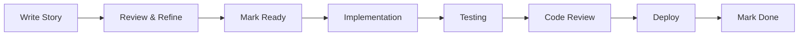

# Providence AI - Feature Documentation

This directory contains agile user stories and feature documentation for the Providence AI platform.

---

## 📂 Directory Structure

```
docs/features/
├── templates/
│   ├── AGILE_STORY_TEMPLATE.md           # Main story template
│   ├── INTERACTIVE_STORY_GUIDE.md        # Question flow for guided creation
│   └── PRODUCT_DEVELOPER_PROMPT.md       # Persona for auto-generation
├── project/                               # Project Management feature stories
├── resource/                              # Resource Management feature stories
├── financial/                             # Fund/Financial Management feature stories
├── human/                                 # Human Management feature stories
└── README.md                              # This file (usage guide)
```

---

## ⚡ Quick Start

**Want to create a story? Choose your approach:**

| Method | Command | Best For |
|--------|---------|----------|
| **Manual** | Copy `AGILE_STORY_TEMPLATE.md` | You know exactly what you want |
| **Interactive** | "Help me create a story" | Need guidance structuring your idea |
| **Auto-Generate** | "Act as a product developer and write a story for [feature]" | Want an expert to write it for you |

---

## ✍️ Three Ways to Create User Stories

Providence AI provides **three workflows** for creating user stories, depending on your preference and situation:

### 🛠️ Method 1: Manual (Copy & Fill Template)
**Best for:** You know exactly what you want and prefer to write it yourself

Copy the template and fill in the sections at your own pace.

### 💬 Method 2: Interactive (Guided Questions)
**Best for:** You have an idea but need help structuring it

Claude Code will ask you questions and generate the story from your answers.

**Activation:** Say "Help me create a story" or "Guide me through writing a story"

### 🎯 Method 3: Product Developer (Auto-Generate)
**Best for:** You have a feature request and want an expert to document it

Claude Code acts as a product developer, analyzes your request, and writes a complete story.

**Activation:** Say "Act as a product developer and write a story for [feature]"

---

## 🛠️ Method 1: Manual Story Creation

### Step 1: Copy the Template

```bash
# Create a new feature directory if it doesn't exist
mkdir -p docs/features/{feature-name}

# Copy the template
cp docs/features/templates/AGILE_STORY_TEMPLATE.md \
   docs/features/{feature-name}/{story-id}-{short-description}.md

# Example:
cp docs/features/templates/AGILE_STORY_TEMPLATE.md \
   docs/features/project/PROV-001-create-project.md
```

### Step 2: Fill in Required Sections

**At a minimum, complete these sections:**

1. **User Story** — "As a [role], I want to [action], so that [benefit]"
2. **Acceptance Criteria** — Clear, testable criteria (must have at least 3)
3. **Business Context** — Problem statement and target users

**These are sufficient to start discussions and planning.**

### Step 3: Expand During Implementation

**As you begin implementation, expand the collapsible sections:**

- **Architecture & Implementation Details** — Affected domains, events, API endpoints
- **Database Schema** — Required migrations
- **Implementation Checklist** — Track progress through domain/application/infrastructure/adapter layers
- **Testing Requirements** — Define unit and integration test scenarios
- **Production Readiness** — Verify all architectural patterns are followed

### Step 4: Update Status

**Update the status field as the story progresses:**
- `Draft` → Story is being written
- `Ready` → Complete and ready for implementation
- `In Progress` → Development has started
- `Done` → Implementation complete, tests passing

---

## 💬 Method 2: Interactive Story Creation

**Activation Commands:**
- "Help me create a story"
- "Guide me through writing a story"
- "Ask me questions to create a story"
- "I have a feature idea, can you help me document it?"

### How It Works

Claude Code will guide you through a **structured question flow** across three phases:

**Phase 1: Story Foundation (Required)**
- Feature name & story ID
- User story components (actor, capability, business value)
- Acceptance criteria (must-have, should-have, out-of-scope)
- Business context (problem, users, success metrics)

**Checkpoint:** You can stop here and generate a basic story (Tier 1)

**Phase 2: Architecture & Implementation (Optional)**
- Affected domains (Project, Resource, Financial, etc.)
- Integration points (APIs, events)
- Database schema
- Security & authorization
- Testing scenarios

**Checkpoint:** You can stop here and generate an implementation-ready story (Tier 2)

**Phase 3: Production Readiness (Optional)**
- Observability (metrics, logs, alerts)
- Error handling & resilience
- Performance & scale requirements

**Final:** Complete story with full production details (Tier 3)

### Example Interaction

```
User: "Help me create a story for project creation"

Claude: Great! I'll guide you through creating a story for project creation.

Q1: What would you like to call this feature? Also, do you have a story ID
(e.g., PROV-123), or should I generate one?

User: "Call it 'Create Project' and use PROV-001"

Claude: Perfect! Story ID: PROV-001, Feature: Create Project

Q2: Let's build the user story. I need three things:
1. Who is the actor/role?
2. What capability or action do they want?
3. Why? What's the business value or outcome?

[... continues through all questions ...]

Claude: ✅ Story created at: docs/features/project/PROV-001-create-project.md

Would you like me to commit it to git?
```

### Benefits
- ✅ **Structured:** Ensures no critical information is missed
- ✅ **Educational:** Teaches Providence AI patterns through questions
- ✅ **Flexible:** Skip optional phases if you just need basics
- ✅ **Conversational:** Natural question-and-answer flow

**Reference:** See `docs/features/templates/INTERACTIVE_STORY_GUIDE.md` for the complete question flow

---

## 🎯 Method 3: Product Developer Auto-Generation

**Activation Commands:**
- "Act as a product developer and write a story for [feature]"
- "Product developer mode: [feature request]"
- "Write a story for [feature] as a product owner"
- "I need a story written for [feature]"

### How It Works

Claude Code will:
1. **Analyze** your feature request
2. **Map** to Providence AI domains and patterns
3. **Ask** clarifying questions (if needed)
4. **Generate** a complete, architecturally-aligned story

### Product Developer Persona

When in this mode, Claude Code acts as an **expert product developer** who:
- Understands Providence AI's multi-tenant, event-driven architecture
- Knows critical patterns (outbox, inbox, idempotency, schema-per-tenant)
- Can map vague requests to concrete, testable acceptance criteria
- Ensures stories align with security, compliance, and quality standards

### Example: Simple Request

```
User: "Act as a product developer and write a story for project creation"

Claude (Product Developer):
I'll create a story for project creation. Let me clarify:

1. Which role should be able to create projects? (e.g., Tenant Admin only,
   or also Project Managers?)
2. What fields are required? I'm thinking: name, description, budget, owner.
   Anything else?

Or I can make reasonable assumptions and you can adjust afterward?

User: "Tenant Admin only, those fields are good"

Claude (Product Developer):
✅ Story created: PROV-001 - Create Project

**User Story:**
As a Tenant Administrator
I want to create projects with name, description, budget, and owner
So that I can organize work across teams and track costs per project

**Key Decisions:**
- Domain: Project Management
- Event: ProjectCreated → ecap.events.ProjectCreated
- Database: New `projects` table in tenant schema
- API: POST /api/v1/projects (requires TENANT_ADMIN role)

**Acceptance Criteria (5 must-have):**
- [ ] Tenant Admin can create project via REST API
- [ ] System validates budget is positive and owner exists
- [ ] ProjectCreatedEvent published to Kafka
- [ ] Audit log entry created
- [ ] Idempotency-Key enforced

Story file: docs/features/project/PROV-001-create-project.md

Would you like me to commit this to git?
```

### Example: Detailed Request

```
User: "Act as a product developer and write a story for resource allocation.
Project managers should be able to assign team members to projects with
start/end dates. We need to track utilization and prevent over-allocation."

Claude (Product Developer):
✅ Story created: PROV-002 - Allocate Resources to Projects

I've analyzed your request and created a comprehensive story with:

**User Story:**
As a Project Manager
I want to allocate team members to projects with defined time periods
So that I can track resource utilization and prevent over-allocation

**Key Features:**
- Resource allocation with start/end dates
- Validation: Prevents over-allocation (checks existing allocations)
- Event: ResourceAllocatedEvent → Triggers utilization calculations
- Database: New `allocations` table with foreign keys to projects & resources
- API: POST /api/v1/allocations (requires PROJECT_MANAGER role)

**Architecture Alignment:**
✓ Multi-tenancy: Allocations in tenant schema
✓ Outbox pattern: Event written in same transaction
✓ Idempotency: Prevents duplicate allocations
✓ Cross-domain integration: Consumes ProjectCreated events

Story file: docs/features/resource/PROV-002-allocate-resources.md

[Shows complete story with Tier 1 + Tier 2 filled in]

Shall I commit this?
```

### Benefits
- ✅ **Fast:** Get complete stories in seconds
- ✅ **Expert-level:** Stories written by a product developer who knows the system
- ✅ **Aligned:** Automatically enforces Providence AI patterns
- ✅ **Complete:** Includes architecture, testing, and implementation guidance

### When to Use
- You have a clear feature request but don't want to write the story yourself
- You need a starting point that you can refine
- You want to see how an expert would structure the story
- You're new to Providence AI and want to learn the patterns

**Reference:** See `docs/features/templates/PRODUCT_DEVELOPER_PROMPT.md` for the complete persona definition

---

## 🎯 Tiered Approach

The template uses a **tiered approach** to balance agility with thoroughness:

### Tier 1: Minimal Viable Story (Required)
```markdown
## User Story
As a [role], I want to [action], so that [benefit]

## Acceptance Criteria
- [ ] Criterion 1
- [ ] Criterion 2
- [ ] Criterion 3

## Business Context
[Problem statement and target users]
```

**Use this tier for:**
- Initial story capture during backlog grooming
- Quick feature ideas that need validation
- Early-stage requirements gathering

### Tier 2: Implementation Planning (Expand as Needed)
```markdown
<details>
<summary>Architecture & Implementation Details</summary>

- Feature Scope
- Database Schema
- Domain Events
- API Endpoints
- Implementation Checklist
- Testing Requirements
</details>
```

**Use this tier when:**
- Story is approved and moving to "Ready" status
- Planning sprint work
- Defining technical approach

### Tier 3: Production Readiness (Pre-Deployment)
```markdown
- Production Readiness Checklist
- Security & Authorization
- Observability (logging, metrics, tracing)
```

**Use this tier when:**
- Implementation is nearly complete
- Preparing for code review
- Final verification before deployment

---

## 🏗️ Architectural Patterns (Critical Reference)

Every story **MUST** adhere to Providence AI's core patterns:

### 1. Schema-Per-Tenant Multi-Tenancy
- All business entities in tenant schemas (`t_<tenant>`)
- Never put business data in public schema
- Tenant context via `ScopedValue<String> TENANT_ID`

### 2. Event-Driven with Outbox Pattern
```java
@Transactional
public void createResource(Command cmd) {
    // 1. Domain mutation
    var resource = Resource.create(cmd);
    repository.save(resource);

    // 2. Outbox event (SAME transaction)
    outbox.save(OutboxEvent.from(new ResourceCreatedEvent(resource)));
}
```

### 3. Inbox Pattern for Exactly-Once Processing
```java
@KafkaListener(topics = "ecap.events.ResourceCreated")
public void handle(ResourceCreatedEvent event) {
    if (inbox.exists(event.eventId())) return; // Duplicate

    processEvent(event);
    inbox.save(new InboxEvent(event));
}
```

### 4. Universal Idempotency
- All state-changing operations require `Idempotency-Key` header
- Cache results for 24 hours
- Return cached response on duplicate (200 OK, not 409)

### 5. Immutable Audit Logging
- All state changes logged to `public.audit_log`
- Never delete audit logs (triggers prevent this)
- Include: actor_id, event_type, aggregate_id, payload (JSONB)

### 6. Financial Integrity
- Use `BigDecimal` for amounts (NEVER float/double)
- Store as integers (cents) in database
- Immutable ledger entries (no updates)
- SERIALIZABLE isolation for critical operations

### 7. Clean Architecture
```
Domain → Application → Infrastructure → Presentation
(Pure logic) → (Services) → (Repos, Kafka) → (REST, gRPC)
```

**For complete details, see:**
- [docs/architecture/ENGINEERING_STANDARDS.md](../architecture/ENGINEERING_STANDARDS.md) — Master reference (2,160 lines)
- [docs/examples/PROJECT_MANAGEMENT.md](../examples/PROJECT_MANAGEMENT.md) — Complete implementation example

---

## 📋 Story Naming Conventions

**File Names:**
```
{STORY-ID}-{short-description}.md
```

**Examples:**
- `PROV-001-create-project.md`
- `PROV-042-allocate-resources.md`
- `PROV-103-ledger-transfer.md`

**Story IDs:**
- Use your project management tool's ID format
- If no tool, use `PROV-XXX` incrementing numbers
- Keep IDs unique across all features

---

## 🧪 Testing in Stories

Every story should define test scenarios:

### Required Test Types

**1. Unit Tests (80%+ coverage)**
```java
@ExtendWith(MockitoExtension.class)
class FeatureServiceTest {
    @Test void happyPath_shouldSucceed() { }
    @Test void invalidInput_shouldThrowException() { }
}
```

**2. Integration Tests (100% endpoint coverage)**
```java
@SpringBootTest
@Testcontainers
class FeatureIntegrationTest {
    @Test void idempotency_duplicateKey_returnsCachedResponse() { }
    @Test void crossTenant_accessDenied() { }
    @Test void inbox_duplicateEvent_skipped() { }
}
```

### Critical Test Scenarios (Always Include)
- ✅ **Idempotency:** Duplicate keys return cached response
- ✅ **Cross-Tenant Isolation:** Access to other tenant's data → 403
- ✅ **Inbox Deduplication:** Replay event → Consumer skips
- ✅ **Outbox Pattern:** Domain mutation → Event published to Kafka
- ✅ **Validation:** Invalid input → 400 with ProblemDetail
- ✅ **Audit Logging:** State change → Audit entry created

---

## 🚀 From Story to Implementation

**Workflow:**



**Steps:**

1. **Write Story** (Tier 1)
   - User story, acceptance criteria, business context
   - Status: `Draft`

2. **Review & Refine**
   - Team reviews story
   - Clarify acceptance criteria
   - Add/remove criteria as needed

3. **Mark Ready**
   - Expand to Tier 2 (architecture, implementation checklist)
   - Status: `Ready`

4. **Implementation**
   - Follow the implementation checklist
   - Reference `PROJECT_MANAGEMENT.md` for patterns
   - Status: `In Progress`

5. **Testing**
   - Write unit tests (80%+ coverage)
   - Write integration tests (100% endpoints)
   - Verify all critical scenarios pass

6. **Code Review**
   - Submit PR with link to story
   - Reviewer verifies story criteria met

7. **Deploy**
   - Merge to main
   - Deploy to environment

8. **Mark Done**
   - Update story status: `Done`
   - Archive or move to completed stories

---

## 📚 Additional Resources

### Internal Documentation
- **[CLAUDE.md](../../CLAUDE.md)** — Auto-loaded context for Claude Code sessions
- **[README.md](../../README.md)** — Project overview and quick start
- **[GETTING_STARTED.md](../guides/GETTING_STARTED.md)** — Local development setup

### Architecture Deep Dives
- **[ENGINEERING_STANDARDS.md](../architecture/ENGINEERING_STANDARDS.md)** — Complete architectural standards (2,160 lines)
- **[MULTI_TENANT_DESIGN.md](../architecture/MULTI_TENANT_DESIGN.md)** — Schema-per-tenant patterns
- **[DATABASE_SCHEMA.md](../architecture/DATABASE_SCHEMA.md)** — Public schema reference
- **[EVENT_STREAMING.md](../architecture/EVENT_STREAMING.md)** — Kafka and CDC patterns

### Implementation Examples
- **[PROJECT_MANAGEMENT.md](../examples/PROJECT_MANAGEMENT.md)** — Complete feature implementation (41KB)
- **[RESOURCE_MANAGEMENT.md](../examples/RESOURCE_MANAGEMENT.md)** — Skeleton template for replication

### External Resources
- Spring Boot 4: https://spring.io/projects/spring-boot
- Debezium Outbox: https://debezium.io/documentation/reference/stable/transformations/outbox-event-router.html
- Kafka Best Practices: https://kafka.apache.org/documentation/

---

## ❓ FAQ

**Q: Do I need to fill in every section of the template?**
A: No. Start with Tier 1 (user story, acceptance criteria, business context). Expand to Tier 2 when planning implementation. Tier 3 is for final verification.

**Q: Can I modify the template?**
A: Yes, but ensure all architectural patterns remain enforceable. The template is designed to ensure compliance with Providence AI standards.

**Q: Where do I put stories for new features not listed in the directory structure?**
A: Create a new directory under `docs/features/{new-feature-name}/` and add your stories there.

**Q: Should I link the story in commit messages or PRs?**
A: Yes! Include `Story: docs/features/{feature}/{story-file}.md` in your PR description.

**Q: What if I have multiple stories for the same feature?**
A: Create multiple files in the same feature directory:
```
docs/features/project/
├── PROV-001-create-project.md
├── PROV-002-update-project.md
├── PROV-003-delete-project.md
└── PROV-004-list-projects.md
```

---

## 📞 Getting Help

**Story Writing:**
- Review existing examples in `docs/examples/`
- Check the template comments for guidance
- Consult ENGINEERING_STANDARDS.md for architectural patterns

**Technical Questions:**
- See CLAUDE.md for comprehensive project context
- Reference PROJECT_MANAGEMENT.md for complete implementation example
- Ask the team during backlog grooming or planning

---

**This directory structure and template ensure that all Providence AI features are built with:**
- ✅ Clear business value articulation
- ✅ Architectural pattern compliance
- ✅ Testability and quality assurance
- ✅ Multi-tenancy and security by default
- ✅ Production readiness from day one

**Last Updated:** 2026-02-12
**Template Version:** 1.0.0
